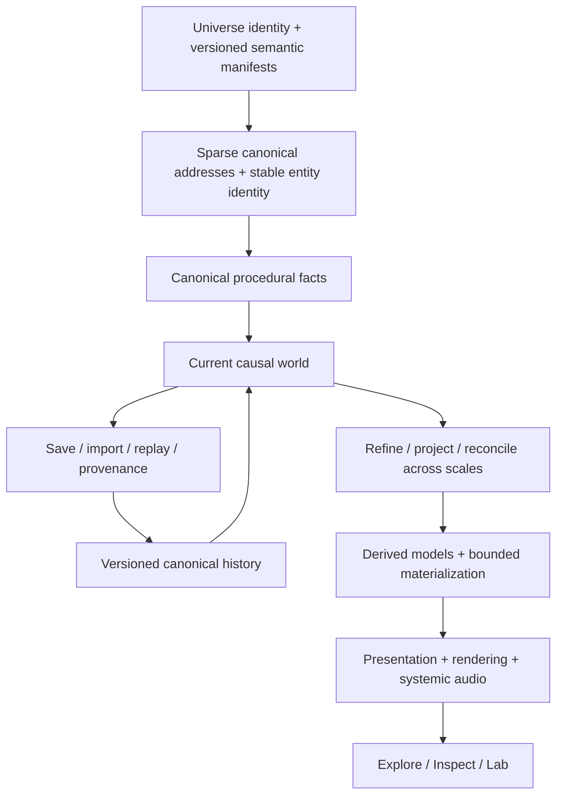
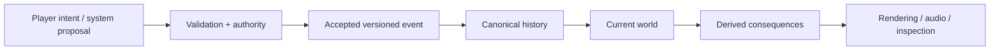

<div align="center">

# ONE FILE UNIVERSE

### A persistent, explorable universe — delivered as one deterministic HTML file.

**Cosmos · Worlds · Life · Civilization · Matter · Causality**

**One file. One universe. Verifiable by construction.**

**Published historical release:** [v1.0.0](https://github.com/VaX1989/One_File_Universe/releases/tag/v1.0.0)

[**What OFU is**](#what-one-file-universe-is) · [**Explore the idea**](#one-continuous-multiscale-reality) · [**Run it**](#build-and-open-the-universe) · [**Contribute**](CONTRIBUTING.md) · [**Governance**](GOVERNANCE.md) · [**Licensing**](LICENSING.md) · [**Evidence**](#release-and-evidence-status)

</div>

---

## What One File Universe is

**One File Universe (OFU)** is an engineering and research project for building a persistent procedural reality that can be explored continuously across radically different scales while preserving identity, causality, history, provenance and scientific/model authority.

Its canonical distribution constraint is intentionally extreme:

> **a complete baseline universe experience in one self-contained offline HTML file.**

The source repository is modular, testable and evidence-gated. **One file is a shipping invariant, not a source-code constraint.** The final HTML is a deterministic build product assembled from modular runtime, simulation, rendering, persistence, product and scientific-model components.

OFU asks a simple product question:

> **What if opening one local file felt less like launching an application and more like entering a universe that already has structure, history and consequences?**

The long-term goal is not to pretend that finite hardware literally computes an infinite or physically complete universe. OFU instead uses sparse deterministic identity, query-driven materialization, explicit model regimes and bounded working sets so the same reality can be refined into different scales without turning each scale into an unrelated demo.

---

## One continuous multiscale reality

The project is organized around a continuity ladder:

```text
Galaxy
  ↓
Region
  ↓
Stellar Neighborhood
  ↓
System
  ↓
Orbit / Planet Approach
  ↓
Planet
  ↓
Global
  ↓
Regional
  ↓
Local
  ↓
Human Scale
  ↓
Microscopic Matter
```

Moving between scales is intended to preserve semantic identity, location context, selected targets, camera intent, history and provenance. A renderer may change representation radically; it may not silently replace the underlying reality with unrelated truth.

The product exposes the same reality through three complementary surfaces:

- **Explore** — direct manipulation and travel through the universe.
- **Inspect** — contextual scientific/model meaning, provenance and causal explanation.
- **Lab** — addresses, manifests, hashes, replay, evidence and diagnostics for expert inspection.

Mouse, keyboard, wheel, pointer and touch interaction are part of the product contract. Accessibility, reduced-motion behavior and mobile constraints are treated as product requirements rather than decorative follow-ups.

---

## Why it is different

| Conventional pattern | One File Universe constraint |
|---|---|
| A universe as a server-backed application | The strict baseline is one local HTML file with no required runtime network dependency. |
| Procedural generation as disposable scenery | Generated state has stable identity, provenance and deterministic derivation. |
| A zoom control that swaps unrelated scenes | Cross-scale travel is designed to preserve semantic context and selection. |
| Scientific-looking graphics imply scientific truth | Canonical truth, derived state, model simulation, empirical relations and presentation remain distinguishable. |
| The whole world must exist in memory | OFU materializes bounded working sets from a sparse reality graph. |
| Saving means serializing UI state | Persistence is tied to universe identity, canonical history, replay and governed mutation. |
| A simulation can silently rewrite its own truth | Canonical mutation passes through explicit authority and versioned events. |
| Rendering quality defines the world | Rendering may approximate presentation but cannot manufacture canonical facts. |
| Reproducibility means “same enough” | Release evidence binds exact source to deterministic single-file reproduction. |
| Research automatically becomes product truth | Research remains non-canonical until deliberately promoted under an explicit authority contract. |

OFU is therefore not simply a space game, static visualization, generic procedural sandbox or collection of scale demonstrations. **Continuity itself is a product primitive.**

---

## Architecture at a glance



OFU deliberately separates epistemic and runtime authority:

```text
CANONICAL_TRUTH
  != DERIVED_CANONICAL_STATE
  != MODEL_DERIVED_SIMULATION
  != EMPIRICAL_RELATION
  != PRESENTATION_ONLY
  != MEASURED_RUNTIME_EVIDENCE
  != USER_AUTHORED / USER_EVENT
```

A renderer, heuristic, research model, imported archive or attractive visualization does not acquire canonical authority merely because it is useful or convincing.

### Reality is a graph, not a permanently materialized object tree

OFU does not instantiate every galaxy, planet, organism, city and molecule forever. Stable identity and semantic relationships exist independently of what is currently materialized. Providers produce bounded representations for the active query context; those representations can be discarded without deleting the universe they represent.

That separation is what makes a self-contained universe technically plausible without claiming infinite computation.

---

## Persistent causality and intervention

OFU is not intended to be a read-only viewer. Canonical world change is governed through versioned events and replayable history.



A player action, imported archive, model proposal or presentation effect cannot silently mutate canonical history merely because it exists in memory. Portable saves are integrity-checked containers, not automatic historical authority.

---

## Determinism, portability and the one-file artifact

The strict product target is **Direct Open**:

- one self-contained HTML artifact;
- offline operation;
- no required runtime network resource;
- deterministic source/build identity;
- bounded runtime materialization;
- direct browser execution through the local `file:` path.

Enhanced execution may opportunistically use additional capabilities, workers or rendering quality, but enhancements are not allowed to change canonical world meaning.

The modular repository builds the standalone product with:

```bash
node tools/build-ofu-rendering-v09.mjs
```

Release certification requires exact-source identity and deterministic reproduction rather than trusting a generated artifact because it “looks correct.”

---

## Release and evidence status

### v1.0.0 — published historical baseline

OFU **v1.0.0 was promoted to `main`, tagged and published on September 6, 2026**. It remains the immutable historical product baseline while later development advances separately.

Certified release identity:

| Property | v1.0.0 |
|---|---|
| Release commit | `38dd0d7c0ccc4a100dc3b75d3d159c6933bc4c16` |
| Git tree | `b7576ebe21b3448b69e35c9cd8d279f51e4332fb` |
| Release asset | `One_File_Universe.html` |
| Artifact bytes | `1512784` |
| Artifact SHA-256 | `013d4277da9acebcbb739275c27f6e05ccbc838840738cd2f9b03bb8f5def61a` |
| Strict single-file | `true` |
| Direct `file:` operation | certified release property |
| Required runtime network | `false` |
| Physical Android | `NOT_CERTIFIED` |
| Physical iOS | `NOT_CERTIFIED` |

The release and downloadable artifact are available from [GitHub Releases](https://github.com/VaX1989/One_File_Universe/releases/tag/v1.0.0).

A green workflow is evidence only for the requirements it actually executed. It is not proof of unmeasured scientific validity, untested physical devices or unlimited simulation fidelity.

### Forward development and 2.0

`main` currently preserves the v1.0.0 historical baseline. Post-v1 and 2.0 development proceeds through controlled development/convergence branches and must not be described as a released 2.0 product until the exact release candidate satisfies its certification and public-launch gates.

The forward community architecture includes a machine-readable 2.0 launch ledger in `config/governance/public-launch-gates.json`. Missing evidence is intentionally not converted into `PASS`.

### Known v1.0.0 limitations

- Visual quality and UX are early and uneven in places.
- Camera and exploration fluidity have substantial room to improve.
- Planetary richness and variety remain limited.
- Local, human and microscopic depth remain limited.
- Physical Android and physical iOS devices were not certified for v1.0.0.
- Scientific/model depth remains incomplete relative to the long-term vision.

Those limitations describe the historical release; they are not the target quality bar for OFU 2.0.

---

## Build and open the universe

### Requirements

- Node.js `24.20.x`
- a modern browser for the generated HTML

```bash
git clone https://github.com/VaX1989/One_File_Universe.git
cd One_File_Universe
node tools/build-ofu-rendering-v09.mjs
```

Then open:

```text
dist/One_File_Universe.html
```

directly in a browser. No local server is required for the strict direct-open path.

Run the repository verification stack with:

```bash
npm test
```

Release workflows execute additional exact-source, browser, reproduction and conformance evidence beyond the base local command.

---

## Open development and contributing

OFU is being prepared for durable public development at a scale far beyond a founder-only repository while preserving strict authority boundaries.

Start here:

```bash
npm run contrib:doctor
npm run contrib:explain -- src/path/file.js
```

Then read:

- [`CONTRIBUTING.md`](CONTRIBUTING.md)
- [`docs/community/START_HERE.md`](docs/community/START_HERE.md)
- [`docs/community/OFU_WAY.md`](docs/community/OFU_WAY.md)
- [`GOVERNANCE.md`](GOVERNANCE.md)

The contributor control plane classifies changes from **R0–R5**, derives affected areas and owners from the exact diff, validates generated CODEOWNERS, and fails closed when a changed path has no declared governance route.

Significant durable subsystems can declare machine-readable **Contribution Units** describing authority, determinism, compatibility, dependencies, tests, resource budgets and shipping-artifact reachability.

The current governance maturity state is intentionally **`BOOTSTRAP`**. Target roles, future organization teams and a future TSC are not represented as operational until real independent maintainers exist to staff them.

### Development model

OFU aims for:

> **maximum decentralization of work, minimum decentralization of invariants.**

Domain maintainers should be able to move quickly inside stable contracts. Canonical identity, history, authority, persistence and release truth remain deliberately hard to change. Multiple qualified Integration Maintainers may eventually exist, while canonical promotion remains serialized through one active integration lease at a time.

---

## Scientific contributions and provenance

Scientific depth is welcome, including competing models and research that is not yet ready for production promotion. Scientific-looking output is never promoted merely because it is plausible or visually impressive.

Model work should make its assumptions, units, valid domain, sources, uncertainty, approximations and forbidden claims explicit. See:

- [`docs/community/SCIENCE_CONTRIBUTIONS.md`](docs/community/SCIENCE_CONTRIBUTIONS.md)
- `config/governance/scientific-model-card.schema.json`

Third-party code, data and assets also require legal provenance. Unknown redistribution rights are not permission to embed material inside the one-file artifact. See:

- [`THIRD_PARTY_POLICY.md`](THIRD_PARTY_POLICY.md)
- [`docs/community/IP_PROVENANCE.md`](docs/community/IP_PROVENANCE.md)
- `data/provenance/`

OFU targets REUSE/SPDX-style machine-readable licensing, but **does not claim complete REUSE compliance** until the historical corpus has actually been audited and migrated.

---

## License and contributor rights

The forward Open Source project policy uses the standard **GNU General Public License v3.0 only (`GPL-3.0-only`)**. See [`LICENSE`](LICENSE) and [`LICENSING.md`](LICENSING.md).

Commercial use under GPL is allowed when its terms are followed. OFU may separately offer commercial licenses granting additional proprietary permissions where it has the legal rights to do so; the Open Source license contains no automatic revenue royalty.

Contributors retain their copyright by default. A pull request is **not** silently treated as copyright assignment or automatic commercial-relicensing permission. The intended contributor-rights mechanism must be legally reviewed and explicitly activated before third-party contributions are represented as commercially relicensable. See [`docs/community/CONTRIBUTOR_RIGHTS.md`](docs/community/CONTRIBUTOR_RIGHTS.md).

The licensing architecture is recorded permanently in [`ADR-027`](docs/adr/ADR-027-open-source-and-dual-licensing.md).

---

## Security

Potential vulnerabilities should follow [`SECURITY.md`](SECURITY.md). Do **not** post exploit details or other sensitive vulnerability information in a normal public issue.

Private vulnerability reporting is a required pre-2.0 public-launch capability and must not be claimed operational until repository administration has actually enabled and verified it.

---

## Repository map

| Path | Purpose |
|---|---|
| [`src/`](src/) | Modular runtime, domains, rendering, product and shipping implementations |
| [`config/components/`](config/components/) | Versioned component declarations |
| [`config/conformance/`](config/conformance/) | Conformance requirements and release contracts |
| [`config/governance/`](config/governance/) | Machine-readable areas, ownership, risk, contribution, provenance and launch governance |
| [`data/`](data/) | Governed embedded/model data and provenance records |
| [`tests/`](tests/) | Foundation, domain, product, browser, resource and anti-regression evidence |
| [`tools/`](tools/) | Validation, contributor control plane, deterministic build and evidence tooling |
| [`reports/`](reports/) | Evidence, witnesses and measured/visual reports |
| [`docs/`](docs/) | Constitution, architecture, product vision, science, roadmap and ADRs |
| [`rfcs/`](rfcs/) | Durable architectural proposal process |

---

## Project authority and key documents

- [Founder Vision](docs/VISION.md)
- [Project Constitution](docs/CONSTITUTION.md)
- [Governance](GOVERNANCE.md)
- [Contributor Start Here](docs/community/START_HERE.md)
- [Long-range Architecture](docs/ARCHITECTURE.md)
- [Multiscale Reality](docs/MULTISCALE_REALITY.md)
- [Product Experience Vision](docs/PRODUCT_EXPERIENCE_VISION.md)
- [Roadmap](docs/ROADMAP.md)
- [Determinism Contract](docs/DETERMINISM.md)
- [Conformance Model](docs/CONFORMANCE.md)
- [Record & Certification Specification](docs/RECORD_SPEC.md)
- [Architecture Decision Records](docs/adr/README.md)
- [Open Source & Dual Licensing ADR](docs/adr/ADR-027-open-source-and-dual-licensing.md)
- [Community-scale Governance ADR](docs/adr/ADR-028-community-scale-governance-and-serial-integration-lease.md)

---

## Current claim boundaries

One File Universe does **not** claim:

- literal infinite computation or complete materialization of the universe;
- first-principles physical fidelity across every spatial and temporal scale;
- that presentation geometry is canonical scientific fact;
- that model-derived simulation is observation or empirical truth;
- that every research branch is already shipping authority;
- physical Android or iOS certification beyond explicitly executed release evidence;
- production-scale external security certification;
- that OFU 2.0 is released or public-launch ready before its exact candidate gates pass;
- that target community roles, organization teams, private reporting channels or contributor-rights infrastructure already exist merely because policy files describe them.

The project **does** claim an engineering architecture intended to make these distinctions inspectable rather than implicit.

That is part of the thesis: a universe becomes more credible when the system can say not only **what it is showing**, but also **why it exists, which model produced it, what authority that model has, what changed it, and what the system does not know.**

---

## Citation

Research and educational users can use [`CITATION.cff`](CITATION.cff) and should identify the exact release or source revision used when reproducibility matters.

---

<div align="center">

### One file is the distribution constraint. The universe is the architecture.

**One File Universe**

</div>
