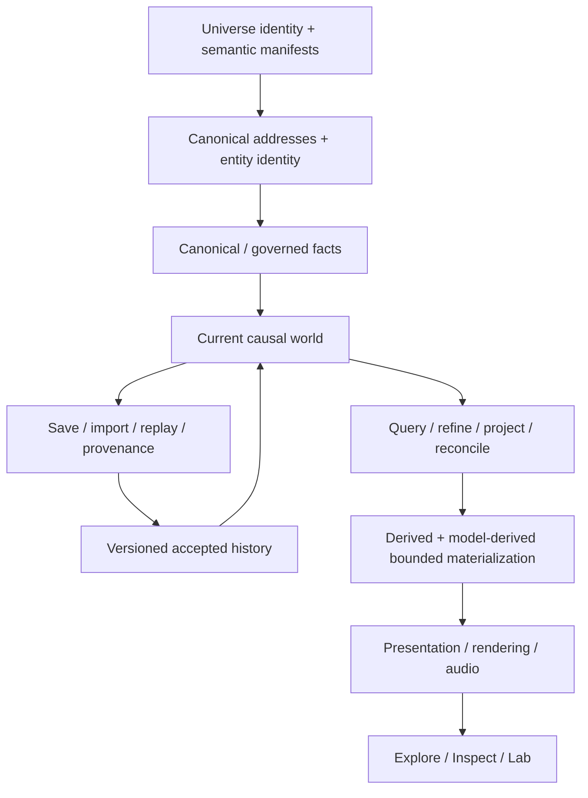

<div align="center">

# ONE FILE UNIVERSE

### A persistent, explorable universe — delivered as one deterministic HTML file.

**Cosmos · Worlds · Life · Civilization · Matter · Causality**

**One file. One universe. Verifiable by construction.**

**Stable historical release: v1.0.0 · V2.0: convergence candidate pending exact-SHA certification**

[**What OFU is**](#what-one-file-universe-is) · [**Same universe across scale**](#the-same-universe-across-scale) · [**Architecture**](#architecture-at-a-glance) · [**Current state**](#where-the-project-stands-now) · [**Roadmap**](docs/ROADMAP.md) · [**Run it**](#build-and-open-the-universe)

</div>

---

## What One File Universe is

**One File Universe (OFU)** is an engineering and research project for building a persistent procedural reality that can be explored across radically different scales while preserving identity, causality, provenance and scientific/model authority.

The canonical distribution target is intentionally extreme:

> **a complete offline universe experience in one self-contained HTML file.**

The repository remains modular, testable and evidence-gated. The one-file artifact is a deterministic build product, not a requirement that source architecture collapse into one unmaintainable source file.

The project does **not** claim literal infinite simulation, perfect physical fidelity at every scale, or one classical physical model extending unchanged from galaxies to atoms. OFU uses sparse deterministic addressing, bounded materialization and explicit model-regime transitions. `UNKNOWN`, `UNSUPPORTED`, model-derived simulation and presentation-only geometry remain distinguishable from promoted scientific/canonical authority.

---

## The same universe across scale

The canonical roadmap now expresses the existing founder/architecture direction in one product phrase:

> **THE SAME UNIVERSE ACROSS SCALE**

The goal is not merely smooth zoom. A selected thing should preserve meaningful identity and context as the product changes scale or representation. Governed consequences should survive revisit/replay, and important visible claims should expose their authority and provenance.

The current exploration ladder spans supported cosmic, planetary, local, human and matter regimes. Cross-scale transitions use explicit `REFINE`, `PROJECT` and `RECONCILE` semantics where the underlying model supports them. A camera transition does not by itself prove scientific or identity continuity.

The product experience is organized around three complementary views of the same selected reality:

- **Explore** — direct manipulation and navigation;
- **Inspect** — contextual meaning, provenance, limitations and causal explanation;
- **Lab** — addresses, hashes, manifests, replay, evidence and diagnostics.

The post-V2 product strategy prioritizes identity continuity, revisit/history, explainability, semantic scale legibility, one exemplary cross-domain causal journey, and only then deeper cinematic/category-leadership polish. See [`docs/ROADMAP.md`](docs/ROADMAP.md).

---

## Architecture at a glance



The central separation is deliberate:

```text
CANONICAL_PROVEN
  != DERIVED
  != MODEL_DERIVED_SIMULATION
  != PRESENTATION_ONLY
  != MEASURED_RUNTIME_EVIDENCE
  != USER_AUTHORED / USER_EVENT
  != UNKNOWN / UNSUPPORTED
```

Authority classes are not confidence decorations. A renderer, heuristic, research model, local AI result or imported archive does not gain canonical authority because it is useful or visually convincing.

### Runtime and distribution invariants

The baseline product preserves:

- one deterministic self-contained HTML distribution;
- direct local `file:` operation and no required runtime network/server;
- WebGL2 as the portable rendering baseline;
- WebGPU only as an optional enhanced path when semantic parity is demonstrated;
- bounded working sets and resource ownership;
- deterministic world identity where claimed;
- governed persistence/replay and event authority;
- explicit provenance/limitation disclosure;
- rendering and camera non-interference with canonical truth.

---

## Where the project stands now

### Stable historical release — v1.0.0

`main` is currently the immutable v1.0.0 historical release baseline:

- commit: `38dd0d7c0ccc4a100dc3b75d3d159c6933bc4c16`;
- tree: `b7576ebe21b3448b69e35c9cd8d279f51e4332fb`;
- tag/release: `v1.0.0`;
- release asset: `One_File_Universe.html`;
- asset SHA-256: `013d4277da9acebcbb739275c27f6e05ccbc838840738cd2f9b03bb8f5def61a`;
- asset bytes: `1,512,784`;
- direct-file/offline baseline: certified for the declared v1 release scope;
- physical Android/iOS: not certified by the v1 release evidence.

That release is history. Post-v1/V2 development does not rewrite its scope or evidence.

### Canonical post-v1 development line

The established development base for the current V2 convergence is:

- branch: `development/v1.1-quality-exploration`;
- authenticated strategy-integration base SHA: `ae406dbc8ac64fbd9161566ac1367bfacf2496f9`;
- tree: `e62971a10f3f54912197bc3904ac2f64e6c525cc`.

### V2.0 convergence candidate

Draft PR #237 composes the V2X development program on:

- branch: `integration/v2x-supreme-total-convergence-2026-09-07`;
- strategy-integration audited head: `9ea22af90b4f1fdd38046ca23501f81ed0b2a839`;
- tree: `cd7b48574ddb7f2c568947d9477d3e8ff819f5a0`.

The V2 integration ledger classifies that state as:

`PROVISIONAL_V2_0_RELEASE_CANDIDATE_PENDING_EXACT_SHA_CERTIFICATION`.

Many V2 exact-head, artifact, authority, browser/runtime and domain-convergence checks are present and substantially green, but the candidate is **not release-closed** while the progressive exact release-conformance gate remains red and PR #237 is unmerged. No roadmap item is allowed to reopen V2.0 merely because it is strategically important.

The current release task is certification/root-cause repair, not new feature expansion.

### Evidence-grounded V2 capability boundary

The V2 candidate contains or centrally reimplements, under explicit authority boundaries:

- adaptive bounded runtime/materialization;
- central Living camera/navigation and semantic-scale travel;
- macrocosm/system/planet/surface/local composition;
- model-derived life/ecology context;
- model-derived civilization/economy/history context;
- bounded persistent-individual identity/refinement infrastructure with known convergence defects still tracked;
- governed causal-action infrastructure;
- selected-source matter continuity into bounded micro/molecular/atomic representations;
- a central Living renderer with a WebGL2 V2X pixel consumer;
- responsive UX/accessibility observers and bounded systemic audio.

It does **not** justify claims of canonical people/memories/genealogy, seamless single-physics simulation from galaxies to atoms, certified physical mobile/assistive-tech operation, mandatory WebGPU, or promotion of research-only V2X science.

The authoritative current integration record is [`docs/parallel/V2_INTEGRATION_LEDGER.json`](docs/parallel/V2_INTEGRATION_LEDGER.json). Exact live GitHub PR/workflow state outranks static documentation when development has advanced.

---

## Strategic direction after V2 closure

The canonical cross-cutting product sequence is maintained only in [`docs/ROADMAP.md`](docs/ROADMAP.md). In dependency order it prioritizes:

1. exact V2 release closure without scope expansion;
2. cross-scale Identity Thread;
3. persistent causal history and revisit;
4. universal provenance/authority explanation;
5. semantic/logarithmic scale legibility;
6. one gold cross-domain intervention journey;
7. coherent Explore / Inspect / Lab progressive disclosure;
8. cinematic scientific embodiment of those same systems;
9. causal discovery;
10. deeper bounded people/civilization/matter continuity;
11. counterfactual and longer-range research frontiers.

The exact scientific/frontier workstream dependency metadata remains in [`docs/frontier/WORKSTREAM_DAG.json`](docs/frontier/WORKSTREAM_DAG.json), with the human-readable current reconciliation in [`docs/FRONTIER_WORKSTREAMS.md`](docs/FRONTIER_WORKSTREAMS.md).

### Explicit scope defense

OFU is not pursuing an AAA content race, MMO/server-required baseline, generic metaverse, generic game engine, full specialist astrophysics solver, full molecular-dynamics platform, or full civilization grand-strategy game. It should also avoid disconnected scale-specific mini-apps and cinematic spectacle detached from persistent world state.

The intended competitive advantage is the connected stack:

`addressable identity → cross-scale lineage → persistent events → deterministic replay → causal explanation → provenance → locally ownable one-file artifact`.

---

## Build and open the universe

### Requirements

- Node.js `24.20.x` for the current V2 source line;
- a modern browser for the generated HTML.

### Build

```bash
git clone https://github.com/VaX1989/One_File_Universe.git
cd One_File_Universe
npm run build
```

The current package build emits the deterministic single-file product through the repository build tooling. Open the generated `dist/One_File_Universe.html` directly where the certified/current profile supports it.

### Validate

```bash
npm run validate
```

For a release claim, repository validation alone is insufficient: use the exact candidate workflow/release transaction and executed browser/artifact evidence for that SHA.

---

## Project authority and key documents

OFU deliberately separates vision, constitutional invariants, architecture, planning, release evidence and research so one document cannot silently redefine another layer.

- [Founder Vision](docs/VISION.md)
- [Project Constitution](docs/CONSTITUTION.md)
- [Long-range Architecture](docs/ARCHITECTURE.md)
- [Product Experience Vision](docs/PRODUCT_EXPERIENCE_VISION.md)
- [Canonical Roadmap](docs/ROADMAP.md)
- [Forward Frontier Workstreams](docs/FRONTIER_WORKSTREAMS.md)
- [Machine Frontier DAG](docs/frontier/WORKSTREAM_DAG.json)
- [V2 Integration Ledger](docs/parallel/V2_INTEGRATION_LEDGER.json)
- [V2 Central Authority Map](docs/parallel/V2_CENTRAL_AUTHORITY_MAP.json)
- [Control Plane](docs/governance/CONTROL_PLANE.md)
- [Determinism Contract](docs/DETERMINISM.md)
- [Conformance Model](docs/CONFORMANCE.md)
- [Record & Certification Specification](docs/RECORD_SPEC.md)
- [Risk Register](docs/RISK_REGISTER.md)

Research reports, issues, lane ledgers and PR descriptions are inputs/evidence or operational coordination. They do not become competing canonical roadmap authority merely by existing.

---

## Research and contribution boundary

OFU can research aggressively while remaining fail-closed about what ships. Research-only work becomes product/canonical authority only through the repository's explicit versioned promotion process.

For contribution and governance details, follow the current repository governance/control-plane documents and live GitHub branch/PR requirements. Never infer release, scientific, device or authority status from source presence alone.
