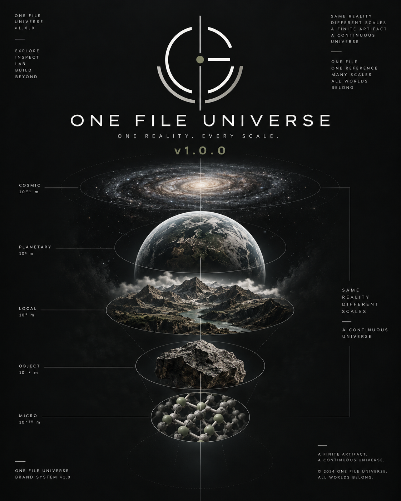
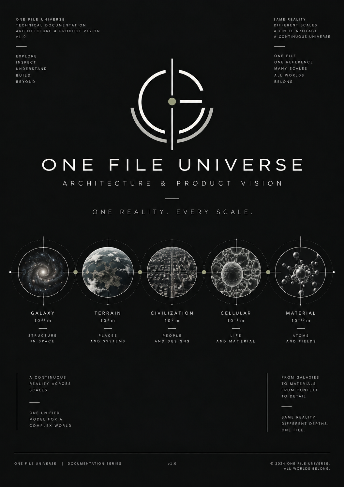
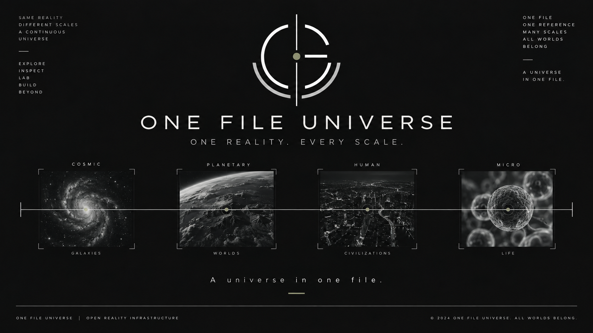
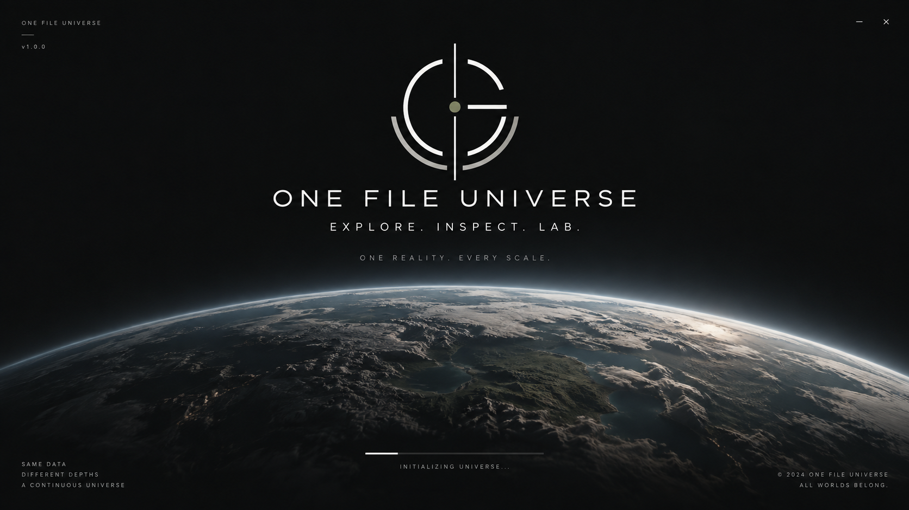
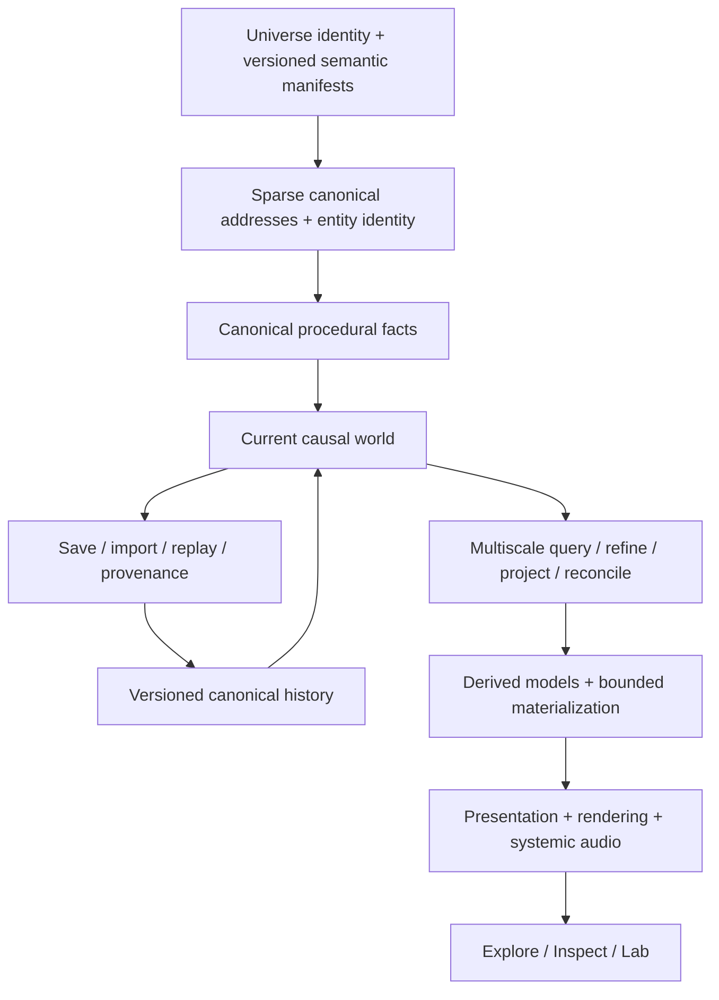

<div align="center">

# ONE FILE UNIVERSE

### One reality. Every scale. One file.

**A deterministic, offline-first multiscale universe engine and product research platform.**

**Cosmos · Worlds · Life · Civilization · Matter · Causality**

**Explore · Inspect · Lab**

[**What OFU is**](#what-one-file-universe-is) · [**Visual system**](#product-identity-and-visual-direction) · [**Explore the universe**](#one-continuous-multiscale-reality) · [**Architecture**](#architecture-at-a-glance) · [**Current programme**](#where-the-project-stands-now) · [**Build it**](#build-and-open-the-universe) · [**Evidence boundaries**](#current-claim-boundaries)

</div>

---

## Product identity and visual direction

The presentation layer is built around a single idea: **the same reality should remain legible as the observer moves across radically different scales.** The visual system therefore treats scale, continuity, selection and provenance as parts of the product language rather than decoration.

> **Presentation note:** these boards are visual-identity and product-direction studies. They communicate the intended interaction and brand grammar; they are **not** evidence that every depicted surface or fidelity level is already shipping.

<p align="center">
  
  
</p>

<p align="center">
  
  
</p>

The product vocabulary is intentionally compact:

- **Explore** — enter and navigate the reality directly.
- **Inspect** — reveal context, provenance, model authority and causal explanation.
- **Lab** — compare, measure, reproduce and test the same reality without creating a second source of truth.

The complete visual assets live in [`docs/presentation/visual-system/`](docs/presentation/visual-system/).

---

## What One File Universe is

**One File Universe (OFU)** is an engineering and research project for building a persistent procedural reality that can be explored continuously across radically different scales while preserving identity, causality, provenance and scientific/model authority.

The canonical distribution target is intentionally extreme:

> **a complete offline universe experience in one self-contained HTML file.**

The source repository remains modular, testable and evidence-gated. The single-file artifact is a deterministic build product, not the source architecture collapsed into one unmaintainable file.

OFU is designed around a simple product question:

**What if opening one local file felt less like launching an application and more like entering a universe that already has structure, history and consequences?**

The player should be able to move from cosmic structure toward a star system, approach a world, descend through planetary and local scales, encounter environments, life and civilization where the active models support them, inspect why a state exists, intervene through governed events, leave, and later return to the same causal reality.

The project does **not** claim literal infinite simulation, perfect physical fidelity at every scale, or one classical Euclidean model extending unchanged from galaxies to quantum mechanics. OFU instead uses a **sparse, query-driven Multiscale Reality Graph** with explicit model regimes, bounded materialization and authority-aware transitions.

---

## One continuous multiscale reality

The v1 product is organized around a continuous exploration ladder rather than a collection of disconnected demos:

```text
Galaxy
  ↓
Region
  ↓
Stellar Neighborhood
  ↓
System
  ↓
Orbit / Planet Approach
  ↓
Planet
  ↓
Global
  ↓
Regional
  ↓
Local
  ↓
Human Scale
  ↓
Microscopic Matter
```

Movement across these scales is not supposed to replace one unrelated scene with another. The runtime preserves semantic scale, selected identity, location context, camera intent, history and provenance as the universe is refined or projected into a different representation.

The product has three complementary ways of engaging with the same reality:

- **Explore** — viewport-first direct manipulation of the universe.
- **Inspect** — contextual scientific/model meaning, provenance and causal explanation.
- **Lab** — addresses, hashes, manifests, replay, evidence and diagnostics for expert inspection.

Mouse, keyboard, wheel, pointer, touch and mobile-oriented interactions are part of the product contract. Reduced-motion and accessibility behavior are treated as product requirements, not optional decoration.

---

## Why it is different

| Conventional pattern | One File Universe constraint |
|---|---|
| A universe as a server-backed application | The strict baseline is one local HTML file with no required runtime network dependency. |
| Procedural generation as disposable scenery | Generated state has stable identity, provenance and deterministic derivation. |
| A zoom slider that swaps unrelated levels | Cross-scale travel preserves semantic context and selection across representations. |
| Scientific-looking graphics imply scientific truth | Canonical truth, derived state, model simulation, empirical relation and presentation-only geometry remain distinguishable. |
| The whole world must exist in memory | OFU materializes bounded working sets from a sparse reality graph. |
| Saving means serializing UI state | Persistence is tied to deterministic world identity, canonical history, replay and governed mutation. |
| A simulation can silently rewrite its own truth | Canonical mutation passes through explicit authority and versioned events. |
| Rendering quality defines the world | Rendering may approximate or beautify presentation, but it cannot manufacture canonical facts. |
| Reproducibility is “same enough” | The release path requires deterministic source reproduction and repeatable single-file builds. |
| Research automatically becomes product truth | Research remains non-canonical until deliberately promoted under an explicit authority contract. |

The result is neither a conventional space game, a static scientific visualization, a generic procedural sandbox, nor a collection of scale demos. OFU is an attempt to make **continuity itself** the core product primitive.

---

## Architecture at a glance


```mermaid
flowchart TD
    U["Universe identity + versioned semantic manifests"]
    A["Sparse canonical addresses + entity identity"]
    C["Canonical procedural facts"]
    H["Versioned canonical history"]
    W["Current causal world"]
    Q["Multiscale query / refine / project / reconcile"]
    M["Derived models + bounded materialization"]
    P["Presentation + rendering + systemic audio"]
    X["Explore / Inspect / Lab"]
    S["Save / import / replay / provenance"]

    U --> A
    A --> C
    C --> W
    H --> W
    W --> Q
    Q --> M
    M --> P
    P --> X
    W --> S
    S --> H
```

The central separation is intentional:

```text
CANONICAL_TRUTH
  != DERIVED_CANONICAL_STATE
  != MODEL_DERIVED_SIMULATION
  != EMPIRICAL_RELATION
  != PRESENTATION_ONLY
  != MEASURED_RUNTIME_EVIDENCE
  != USER_AUTHORED / USER_EVENT
```

A renderer, heuristic, research model or imported archive does not acquire canonical authority merely because it is useful or visually convincing.

### Reality is a graph, not an object tree

OFU does not permanently instantiate every galaxy, planet, organism, city and molecule. Stable identity and semantic relationships exist independently of what is currently materialized. Runtime providers produce bounded representations for the active query context, and those representations can be discarded without deleting the universe they represent.

That separation is what makes an offline single-file universe technically plausible without pretending that finite hardware contains an actually infinite simulation.

---

## Historical v1 massive-parallel convergence

The v1.0.0 historical convergence was the result of a large parallel development program built from one exact common base and harvested into a single product line.

**V1X-01 through V1X-14 are shipping convergence work.** Their implementations, provider/catalog surfaces, tests and conformance material are represented in the v1 product line rather than remaining isolated development branches.

| Lane | Shipping system | Product responsibility |
|---|---|---|
| **V1X-01** | Camera / Scale / Reference Frames | Continuous semantic travel and frame authority |
| **V1X-02** | Spatial Universe | Deterministic spatial structure and 3D projection |
| **V1X-03** | Macrocosm Rendering | Large-scale universe presentation |
| **V1X-04** | Stellar / System Rendering | Stellar-system structure, perspective and continuity |
| **V1X-05** | Planet Approach | Orbit-to-planet transition and planetary presentation |
| **V1X-06** | Surface / Local / Human | Surface frames, terrain LOD and local-scale embodiment |
| **V1X-07** | Life / Ecology | Authority-gated ecological and organism presentation |
| **V1X-08** | Civilization / History | Causal civilization/history embodiment and consequences |
| **V1X-09** | Microscopic Matter | Bounded microscopic experience and authority boundaries |
| **V1X-10** | UX / Mobile / Accessibility | Direct manipulation, viewport UX and accessibility |
| **V1X-11** | Runtime / Streaming / Resources | Scheduling, lifecycle, bounded resources and recovery |
| **V1X-12** | Persistence / Gameplay / Intervention | Save, import, replay and governed world actions |
| **V1X-13** | Systemic Audio | Contextual audio, controls and accessibility behavior |
| **V1X-14** | Certification / Evidence | Anti-regression, evidence manifests and release proof |

The convergence also closed shared defects that only became visible when the lanes were exercised as one system: active renderer/provider binding, continuous wheel/pinch scale authority, session/import atomicity, replay semantics, resource reservation and context recovery, scientific uncertainty disclosure, history/civilization provenance and final runtime-graph bindings.

The authoritative integration record is [`docs/integration/V1_MASTER_CONVERGENCE_LEDGER.md`](docs/integration/V1_MASTER_CONVERGENCE_LEDGER.md).

---

## Research frontier beyond the shipping v1

The massive parallel program also produced deeper research lanes. They are deliberately preserved as **research/future capability**, not silently relabeled as shipping truth.

| Research line | Frontier |
|---|---|
| **V1X-15** | Astronomy / cosmic depth |
| **V1X-16** | Deep planetary causality |
| **V1X-17** | Life / ecology / evolution depth |
| **V1X-18** | Civilization / history / individuals depth |
| **V1X-19** | Material / molecular / atomic depth |
| **AI-F0** | Local inference feasibility / embedded small-model research |

These lines form a reserve of future scientific and systemic depth. Their useful findings may be promoted incrementally when they satisfy the relevant authority, determinism, resource and product constraints. Their existence alone does not make their outputs canonical v1 reality.

This distinction is central to OFU: **the project can research aggressively without weakening the epistemic meaning of what ships.**

---

## Persistent causality and player intervention

OFU is not intended to be a read-only universe viewer.

Canonical world change is governed through versioned events and replayable history. A player action, imported archive, model proposal or presentation effect cannot silently mutate canonical state. The intended causal path is explicit:


```mermaid
flowchart LR
    I["Player intent / system proposal"]
    V["Validation + authority"]
    E["Accepted versioned event"]
    H["Canonical history"]
    W["Current world"]
    D["Derived consequences"]
    R["Rendering / audio / inspection"]

    I --> V
    V --> E
    E --> H
    H --> W
    W --> D
    D --> R
```

Save/import is therefore more than convenience serialization. Portable archives are integrity-checked containers; they do not become historical admission or canonical authority merely because their bytes are valid.

---

## Determinism, portability and the one-file artifact

The strict runtime profile is **Direct Open**:

- one self-contained HTML artifact;
- offline execution;
- no required runtime network resource;
- no canonical dependence on origin-bound browser storage;
- deterministic build inputs and source identity;
- bounded runtime materialization;
- browser execution through the local `file:` path.

Enhanced execution may opportunistically use additional browser capabilities, workers or rendering quality, but enhancements are not allowed to change canonical world meaning.

The final artifact is built from the modular repository with:

```bash
node tools/build-ofu-rendering-v09.mjs
```

The release certification path builds the artifact twice and requires byte-for-byte equality of both the HTML and rendering build manifest for the same exact source commit.

---

## Where the project stands now

One File Universe has a deliberately separated history: **v1.0.0 remains the immutable historical baseline**, while the current source line has advanced into the post-v1 / 2.0.0 development programme. Later work does not retroactively rewrite the v1 evidence boundary.

The current integrated programme checkpoint records **96/96 canonical prompts reconciled**. At the last executable semantic checkpoint, the root workflow matrix was **10/10 PASS** and the Spatial Continuum convergence suite was **15/15 PASS**. The remaining items are explicitly gated rather than cosmetically marked complete.

| Surface | Current state |
|---|---|
| Source package | **2.0.0 development line** |
| Historical baseline | **v1.0.0**, preserved as a historical identity |
| Distribution target | **One self-contained HTML artifact** |
| Product modes | **Explore · Inspect · Lab** |
| Canonical programme accounting | **96 / 96 prompts reconciled** |
| COMPLETE | **44** |
| BLOCKED_BY_DECLARED_DEPENDENCY | **40** |
| INDEPENDENT_AUDIT_REQUIRED | **1** |
| MANUAL_GATE_REQUIRED | **10** |
| EXTERNAL_EVIDENCE_REQUIRED | **1** |
| Last executable semantic subject | `7c413efb051994c42c52c3642aeacddad8716485` |
| Exact-head workflow evidence at that subject | **10 / 10 PASS** |
| Spatial convergence evidence at that subject | **15 / 15 mandatory suites PASS** |
| Physical Android / iOS / real-device GPU evidence | **NOT_VERIFIED** |
| Project license | **Not selected** |

The authoritative programme handoff is [`docs/industrialization/control/OFU_FINAL_PROGRAMME_COMPLETION_HANDOFF_2026-09-20.md`](docs/industrialization/control/OFU_FINAL_PROGRAMME_COMPLETION_HANDOFF_2026-09-20.md). It distinguishes completed work from manual gates, external evidence, independent audit requirements and dependency-blocked work instead of collapsing them into a single “done” label.

The historical v1.0.0 identity remains rooted at commit `6d1c8bcc18557eb654e3259bf419890b761acfa9` and tree `ac6d9444453704fb27ea437a879d8b6e7370762c`. That baseline is preserved as a historical starting point, not as a claim that the project has reached its final intended quality or scientific depth.

### Known evidence boundaries

- Visual quality and UX are still evolving and should not be inferred from concept boards alone.
- Planetary, local, human and microscopic depth remain bounded by implemented providers and model authority.
- Physical Android, physical iOS and real-device GPU operation remain unverified.
- Independent G1 audit and several later programme gates remain intentionally external or manual.
- Scientific/model limitations remain explicit in authority and provenance metadata.
- A passing workflow is evidence for the requirements it executes, not proof of unmeasured scientific validity or unlimited simulation fidelity.

---

## Build and open the universe

### Requirements

- Node.js `24.20.x`
- a modern browser for the generated HTML

The core repository has no normal runtime service requirement.

### Build

```bash
git clone https://github.com/VaX1989/One_File_Universe.git
cd One_File_Universe
node tools/build-ofu-rendering-v09.mjs
```

Then open:

```text
dist/One_File_Universe.html
```

directly in a browser. No local server is required for the strict direct-open product path.

### Verify the foundation

```bash
npm test
```

The definitive release workflow runs additional V1/V1X conformance, browser and bounded-soak stages beyond the base `npm test` command.

---

## Repository map

| Path | Purpose |
|---|---|
| [`src/`](src/) | Modular runtime, domains, rendering, exploration and shipping implementations |
| [`src/extensions/v1x-shipping-bindings.js`](src/extensions/v1x-shipping-bindings.js) | Runtime graph bindings for shipped V1X providers |
| [`config/components/`](config/components/) | Versioned component declarations |
| [`config/conformance/`](config/conformance/) | Conformance requirements and lane-level release contracts |
| [`data/`](data/) | Governed embedded data used by supported model domains |
| [`tests/`](tests/) | Foundation, domain, product, browser, V1X, resource and anti-regression tests |
| [`tools/`](tools/) | Validation, deterministic build and evidence tooling |
| [`reports/`](reports/) | Lane evidence, witnesses and measured/visual reports |
| [`docs/`](docs/) | Constitution, architecture, vision, authority, roadmap, ADRs and research |
| [`docs/integration/V1_MASTER_CONVERGENCE_LEDGER.md`](docs/integration/V1_MASTER_CONVERGENCE_LEDGER.md) | Authoritative v1 integration-status record |

---

## Project authority and key documents

OFU keeps product vision, architecture, scientific authority and integration evidence separate so one document cannot silently redefine another layer.

- [Founder Vision](docs/VISION.md)
- [Project Constitution](docs/CONSTITUTION.md)
- [V1 Implementation Contract](docs/governance/V1_IMPLEMENTATION_CONTRACT.md)
- [V1 Master Convergence Ledger](docs/integration/V1_MASTER_CONVERGENCE_LEDGER.md)
- [Long-range Architecture](docs/ARCHITECTURE.md)
- [Multiscale Reality](docs/MULTISCALE_REALITY.md)
- [Product Experience Vision](docs/PRODUCT_EXPERIENCE_VISION.md)
- [Roadmap](docs/ROADMAP.md)
- [Frontier Workstreams](docs/FRONTIER_WORKSTREAMS.md)
- [Parallel Development Architecture](docs/PARALLEL_DEVELOPMENT_ARCHITECTURE.md)
- [State-of-the-Art Research](docs/STATE_OF_THE_ART_RESEARCH_2026.md)
- [Determinism Contract](docs/DETERMINISM.md)
- [Conformance Model](docs/CONFORMANCE.md)
- [Record & Certification Specification](docs/RECORD_SPEC.md)
- [Risk Register](docs/RISK_REGISTER.md)
- [Architecture Decision Records](docs/adr/README.md)

---

## Current claim boundaries

One File Universe does **not** currently claim:

- literal infinite computation or complete materialization of the universe;
- first-principles physical fidelity across every spatial and temporal scale;
- that presentation geometry is canonical scientific fact;
- that model-derived simulations are observations or empirical truth;
- that research V1X-15–19 or AI-F0 are already shipping v1 authority;
- physical Android or iOS validation;
- production-scale security certification or an external scientific audit;
- that the v1.0.0 historical baseline is the final intended quality or depth of One File Universe;

The project **does** claim an engineering architecture designed to make those distinctions inspectable rather than implicit.

That is part of the product thesis: a universe becomes more credible when the system can say not only **what it is showing**, but also **why it exists, which model produced it, what authority that model has, what changed it, and what the system does not know.**

---

## Development and research policy

Shipping work advances through exact source identities, explicit ownership, deterministic build inputs, conformance evidence and controlled convergence. Research may move faster and explore more speculative depth, but it does not become canonical universe truth through proximity, ancestry or presentation quality.

Material defects are fixed at the layer that owns them; requirements are not weakened to make a gate green.

The long-range destination remains larger than v1: deeper astronomy, planetary causality, ecology/evolution, civilization/history, microscopic matter and carefully bounded local inference can all extend the same universe without replacing its identity or rewriting certified history.

---

## License

No project license has been selected yet. Until a license is explicitly added, do not assume permission beyond applicable copyright law.

---

<div align="center">

### One file is the distribution constraint. The universe is the architecture.

**One File Universe**

</div>
