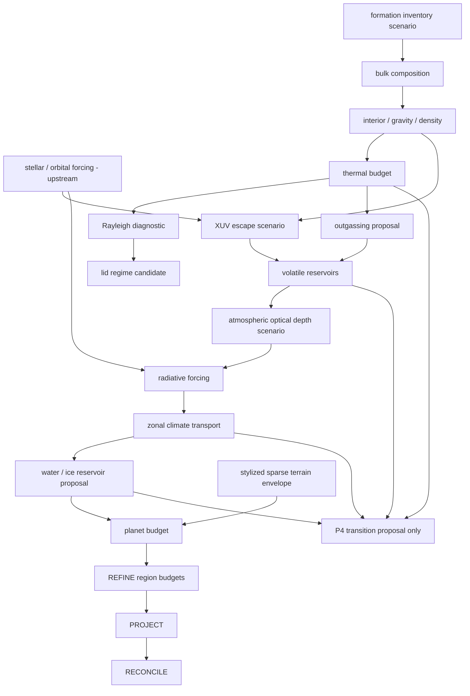

# R&D-16 Domain Decomposition and Causal Graph

## Decomposition

1. **Formation/input inventory boundary** — accepts scenario composition and upstream stellar/orbital forcing; it does not reroll P3/P5 facts.
2. **Bulk/interior** — bounded rocky bulk proxy, gravity/density, global thermal reservoir and Rayleigh diagnostic.
3. **Geodynamics** — candidate convection/lid regime labels; future work owns melt, tectonics and outgassing rate laws.
4. **Volatile evolution** — exact reservoirs; outgassing/condensation can enter through explicit transfers; XUV escape is an optional energy-limited research transition.
5. **Atmosphere/radiation** — optical depth is an explicit research input; grey atmosphere produces a model temperature, not a canonical surface temperature.
6. **Climate transport** — bounded zonal energy state with conservative nearest-neighbor transport and explicit external forcing.
7. **Hydrology/ice** — exact water reservoir transfers plus a deliberately low-fidelity temperature-only phase proposal.
8. **Terrain/hypsometry** — only a bounded sparse deterministic texture envelope exists here; physical hypsometry remains unsupported.
9. **Giant planets** — family taxonomy and heavy-element bookkeeping only; radius and atmosphere remain unsupported.
10. **Cross-scale seam** — exact planet-total budget partition into a bounded active region set via REFINE, aggregation via PROJECT, and fail-closed RECONCILE.
11. **Temporal seam** — research evolution emits a P4-targeted proposal, never a canonical event.

## Causal governance

A graph edge means “may provide an input to a research submodel,” not “scientifically identified cause in every planet.” No edge grants truth authority. Exogenous histories (stellar XUV, impacts, accretion, rheology parameters, atmospheric opacity) remain inputs until separate source-backed transition models exist.

P4 remains the only canonical temporal owner. The lane has no private clock, no EventId authority, no event ordering authority, and no admission/replay/checkpoint authority.
